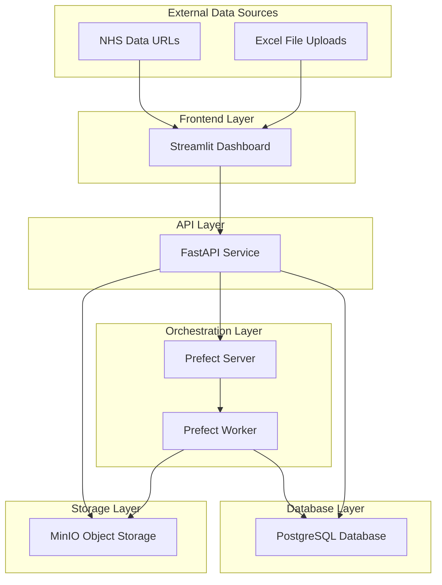

# NHS Bed Occupancy Data Pipeline - Technical Documentation

## Overview

This project creates an automated data pipeline to process NHS bed occupancy data that gets published quarterly. The pipeline downloads Excel files, cleans the data, and produces multiple outputs including an interactive dashboard and a database.

## Dataset Choice

**Dataset**: NHS Bed Occupancy Data (Beds Open Overnight)  
**Source**: https://www.england.nhs.uk/statistics/statistical-work-areas/  
**Format**: Excel files (.xlsx) with multi-header structure  
**Update Frequency**: Quarterly (Q1, Q2, Q3, Q4)  
**Example URL**: https://www.england.nhs.uk/statistics/wp-content/uploads/sites/2/2024/05/Beds-Open-Overnight-Web_File-Q3-2023-24-Revised-POKJH.xlsx

**Why this dataset?**
- Meets the health data preference mentioned in requirements
- Regular quarterly updates simulate real-world pipeline needs
- Complex Excel structure demonstrates data engineering skills
- Publicly available without authentication requirements

## Pipeline Architecture

### High-Level Architecture



### Data Flow

The pipeline follows this consistent pattern for both file uploads and URL downloads:

```
User Input → Streamlit → FastAPI → MinIO Storage → Prefect Worker → PostgreSQL Database
```

## Containerized Architecture

### Why Docker?

I chose Docker containerization for several key reasons:

1. **Isolation**: Each service runs in its own container, preventing conflicts between different Python versions, dependencies, and configurations
2. **Reproducibility**: The exact same environment runs on any machine - development, testing, or production
3. **Scalability**: Individual services can be scaled independently based on demand
4. **Maintainability**: Each container has a single responsibility, making updates and debugging easier
5. **Portability**: Easy migration to cloud platforms (Azure, AWS) without architecture changes
6. **Development Velocity**: Team members can spin up the entire stack with one command

### Container Breakdown

#### 1. **Streamlit Container** (`services/streamlit/`)
- **Purpose**: Frontend web application for user interface
- **Base Image**: `python:3.9-slim`
- **Port**: 8501
- **Responsibilities**:
  - Serves interactive dashboard with Plotly visualizations
  - Handles file uploads and URL inputs
  - Displays real-time analytics and charts
  - Provides pipeline status monitoring interface
- **Key Dependencies**: streamlit, plotly, pandas, requests
- **Why Separate Container**: Frontend should be independently scalable and deployable

#### 2. **FastAPI Container** (`services/api/`)
- **Purpose**: REST API gateway and pipeline orchestration
- **Base Image**: `python:3.10-slim`
- **Port**: 5001
- **Responsibilities**:
  - Handles HTTP requests from Streamlit frontend
  - Downloads files from external URLs
  - Manages MinIO file storage operations
  - Triggers Prefect workflows
  - Provides data access endpoints
- **Key Dependencies**: fastapi, uvicorn, httpx, prefect-client, minio, psycopg2
- **Why Separate Container**: API layer should be stateless and horizontally scalable

#### 3. **Prefect Server Container** (`services/prefect-server/`)
- **Purpose**: Workflow orchestration engine and UI
- **Base Image**: `prefecthq/prefect:2.19.3-python3.10`
- **Port**: 4200
- **Responsibilities**:
  - Manages workflow definitions and deployments
  - Schedules and monitors flow executions
  - Provides workflow UI dashboard
  - Maintains execution history and logs
- **Key Dependencies**: prefect (full server installation)
- **Why Separate Container**: Workflow orchestration is a distinct concern requiring its own resources

#### 4. **Prefect Worker Container** (`services/prefect-worker/`)
- **Purpose**: Data processing engine that executes workflows
- **Base Image**: `prefecthq/prefect:2.19.3-python3.10`
- **No External Port** (internal communication only)
- **Responsibilities**:
  - Executes data processing workflows
  - Downloads files from MinIO storage
  - Parses Excel files with pandas
  - Transforms and validates data
  - Inserts processed data into PostgreSQL
- **Key Dependencies**: prefect, pandas, openpyxl, minio, psycopg2
- **Why Separate Container**: Processing workloads should be isolated and scalable independently

#### 5. **PostgreSQL Container**
- **Purpose**: Primary database for structured data storage
- **Base Image**: `postgres:14-alpine`
- **Port**: 5433 (mapped to avoid conflicts with local PostgreSQL)
- **Responsibilities**:
  - Stores processed bed occupancy data
  - Provides ACID compliance for data integrity
  - Supports analytical queries from API
  - Maintains data relationships and constraints
- **Data Persistence**: Docker volume `postgres_data`
- **Why Separate Container**: Database should be independently managed with dedicated resources

#### 6. **MinIO Container**
- **Purpose**: S3-compatible object storage (data lake)
- **Base Image**: `minio/minio:latest`
- **Ports**: 9000 (API), 9001 (Web Console)
- **Responsibilities**:
  - Stores uploaded Excel files
  - Archives downloaded files from URLs
  - Maintains complete audit trail
  - Provides S3-compatible API for file operations
- **Data Persistence**: Docker volume `minio_data`
- **Why Separate Container**: Object storage requires dedicated disk I/O and should be independently scalable

### Container Communication

**Network Architecture**:
- All containers run on Docker's default bridge network
- Services communicate using container names as hostnames
- Internal communication happens on internal ports
- Only necessary ports are exposed to the host

**Communication Patterns**:
```
Streamlit → FastAPI: HTTP requests (user interactions)
FastAPI → Prefect Server: Workflow API calls (trigger pipelines)
FastAPI → MinIO: S3 API calls (file storage)
FastAPI → PostgreSQL: Database queries (data access)
Prefect Server → Prefect Worker: Workflow execution
Prefect Worker → MinIO: File retrieval
Prefect Worker → PostgreSQL: Data insertion
```

### Docker Compose Configuration

The `docker-compose.yml` orchestrates all containers with:

- **Service Dependencies**: Ensures containers start in correct order
- **Health Checks**: Monitors service availability before dependent services start
- **Volume Mounts**: 
  - Persistent data volumes for database and object storage
  - Code volumes for development (live reloading)
  - Shared code library mounted across relevant containers
- **Environment Variables**: Configuration passed to containers
- **Network Configuration**: Automatic service discovery between containers

**Example Service Definition**:
```yaml
api:
  build: ./services/api
  ports:
    - "5001:5001"
  volumes:
    - ./services/api:/app
    - ./shared:/app/shared
  depends_on:
    prefect-server:
      condition: service_healthy
    db:
      condition: service_healthy
    minio:
      condition: service_healthy
```

## Data Processing Flow

### 1. Data Input
Two ways to trigger the pipeline:
- **File Upload**: User uploads Excel file through web interface
- **URL Input**: User provides NHS data URL for automatic download

### 2. Unified Storage Pattern
**All data flows through MinIO storage first:**

#### File Upload Scenario:
1. User uploads Excel file via Streamlit container
2. FastAPI container saves file to MinIO container (`nhs_uploads/` folder)
3. FastAPI container triggers Prefect Server to start workflow
4. Prefect Worker container retrieves file from MinIO and processes it
5. Processed data saved to PostgreSQL container

#### URL Download Scenario:
1. User enters NHS data URL via Streamlit container
2. FastAPI container downloads file from external URL
3. FastAPI container saves downloaded file to MinIO container (`url_downloads/` folder)
4. FastAPI container triggers Prefect Server with MinIO file path
5. Prefect Worker container retrieves file from MinIO and processes it
6. Processed data saved to PostgreSQL container

### 3. Data Processing Pipeline
When Prefect Worker processes files:
1. **Downloads file from MinIO** storage
2. **Parses Excel file** handling multi-header structure (rows 13-14)
3. **Cleans and transforms data** (column mapping, validation)
4. **Calculates metrics** (occupancy rates, percentages)
5. **Saves to PostgreSQL** with proper schema

## Key Technical Features

### Data Processing Pipeline Code
```python
@flow
def nhs_bed_occupancy_pipeline_flow(url: str, is_upload: bool = False):
    # Download file from MinIO storage (consistent for both scenarios)
    file_path = download_data_task(url)
    
    # Process Excel data with pandas
    processed_data = process_bed_occupancy_data_task(file_path)
    
    # Save to PostgreSQL database
    store_bed_occupancy_data_task(processed_data)
```

### Excel Data Processing
- Handles complex multi-header Excel structure (rows 13-14 as headers)
- Automatic column mapping for different file versions
- Data validation and quality checks
- Calculation of occupancy rates and derived metrics

### Database Schema
```sql
CREATE TABLE bed_occupancy (
    organisation_code VARCHAR(10),
    organisation_name VARCHAR(255),
    beds_available INTEGER,
    beds_occupied INTEGER,
    occupancy_rate DECIMAL(5,2),
    quarter VARCHAR(10),
    year INTEGER,
    created_at TIMESTAMP,
    updated_at TIMESTAMP
);
```

### MinIO Storage Organization
```
minio://uploaded-files/
├── nhs_uploads/        # User uploaded files
│   └── 2025-07-13T20:25:04_filename.xlsx
├── url_downloads/      # Files downloaded from URLs
│   └── 2025-07-13T20:30:45_NHS-Data-File.xlsx
└── prefect-results/    # Pipeline artifacts
```

## Running the Pipeline

### Prerequisites
- Docker and Docker Compose installed
- 8GB+ RAM recommended
- Ports 4200, 5001, 5433, 8501, 9000, 9001 available

### Quick Start
```bash
# Clone repository
git clone https://github.com/ZohraB612/de_eh.git
cd de_eh

# Start all containers
docker-compose up --build

# Access dashboard
open http://localhost:8501
```

### Container Startup Sequence
1. **PostgreSQL** and **MinIO** start first (foundation services)
2. **Prefect Server** starts after database is healthy
3. **FastAPI** starts after all dependencies are healthy
4. **Prefect Worker** connects to server and creates deployments
5. **Streamlit** starts after API is available

### Using the Pipeline

1. **Access Dashboard**: Navigate to http://localhost:8501
2. **Upload Data**: 
   - Use "Data Upload" tab
   - Either upload Excel file or enter NHS URL
   - Click "Upload and Process" or "Download and Process"
3. **Monitor Progress**: Check "Pipeline Status" tab with flow run ID
4. **View Results**: Return to "Dashboard" tab to see processed data

## Outputs Produced

### 1. Interactive Dashboard (Streamlit Container)
- **URL**: http://localhost:8501
- **Features**: 
  - Summary metrics (total organizations, average occupancy)
  - Distribution charts showing occupancy patterns
  - Top performers analysis
  - Filterable data table

### 2. Database Output (PostgreSQL Container)
- **Connection**: localhost:5433
- **Database**: mydatabase
- **Table**: bed_occupancy
- **Records**: One row per NHS trust per quarter

### 3. API Endpoints (FastAPI Container)
- `GET /nhs-data/occupancy` - Retrieve all processed data
- `POST /nhs-data/trigger-pipeline` - Trigger processing from URL
- `POST /nhs-data/upload` - Upload and process file
- `GET /nhs-data/status/{flow_run_id}` - Check pipeline status

### 4. Data Lake Storage (MinIO Container)
- **MinIO Console**: http://localhost:9001 (minioadmin/minioadmin)
- **Complete audit trail** of all processed files with timestamps

### 5. Workflow Orchestration (Prefect Container)
- **Prefect UI**: http://localhost:4200
- **Features**:
  - Real-time pipeline execution monitoring
  - Flow run history and status tracking
  - Task-level execution details and logs
  - Workflow scheduling and management
  - Performance metrics and execution times

## Business Value

### Problem Solved
Manual processing of quarterly NHS Excel files is time-consuming and error-prone. This pipeline automates the entire workflow.

### Benefits
- **Time Savings**: Reduces processing from hours to minutes
- **Data Quality**: Automated validation eliminates human errors
- **Accessibility**: Web dashboard provides 24/7 access to insights
- **Audit Trail**: Complete history of processed files in object storage
- **Scalability**: Containerized services can scale independently

### Use Cases
- **Capacity Planning**: Identify trusts near capacity limits
- **Performance Monitoring**: Track occupancy trends over time
- **Resource Allocation**: Data-driven bed distribution decisions
- **Comparative Analysis**: Benchmark performance across trusts

## Technical Stack

| Container | Technology | Purpose |
|-----------|------------|---------|
| Streamlit | Streamlit + Plotly | Interactive dashboard |
| FastAPI | FastAPI + Uvicorn | REST API and orchestration |
| PostgreSQL | PostgreSQL 14 | Structured data storage |
| MinIO | MinIO (S3-compatible) | Object storage and data lake |
| Prefect Server | Prefect 2.19.0 | Workflow orchestration |
| Prefect Worker | Prefect + Pandas | Data processing engine |

## Advantages of This Architecture

### Development Benefits
- **Local Development**: Full stack runs identically across all machines
- **Code Changes**: Live reloading for rapid development cycles
- **Debugging**: Each service can be inspected independently
- **Testing**: Services can be tested in isolation

### Production Benefits
- **Cloud Migration**: Containers deploy directly to Azure/AWS
- **Scaling**: Each service scales based on demand patterns
- **Monitoring**: Container-level metrics and health checks
- **Updates**: Zero-downtime rolling updates possible

### Operational Benefits
- **Backup**: Database and storage volumes can be backed up independently
- **Security**: Network isolation between services
- **Resource Management**: CPU/memory limits per container
- **Fault Tolerance**: Service failures don't affect other components

## Cloud Migration Path

The containerized architecture provides a clear path to Azure cloud deployment:
- **Azure Container Apps**: Direct container deployment
- **Azure Database for PostgreSQL**: Managed database service
- **Azure Blob Storage**: Replace MinIO with enterprise object storage
- **Azure Data Factory**: Enhanced workflow orchestration

## Troubleshooting

### Health Checks
- API: http://localhost:5001/health
- Prefect UI: http://localhost:4200
- MinIO Console: http://localhost:9001
- Dashboard: http://localhost:8501

### Container Debugging
```bash
# View container logs
docker-compose logs [service_name]

# Access container shell
docker-compose exec [service_name] /bin/bash

# Check container status
docker-compose ps
```

### Common Issues
1. **Port conflicts**: Ensure required ports are available
2. **Memory issues**: Requires 8GB+ RAM for all containers
3. **File format**: Only .xlsx and .xls files supported
4. **Container startup order**: Wait for health checks to complete

## Repository

**GitHub Repository**: https://github.com/ZohraB612/de_eh  
**Live Demo**: All services accessible after running `docker-compose up`