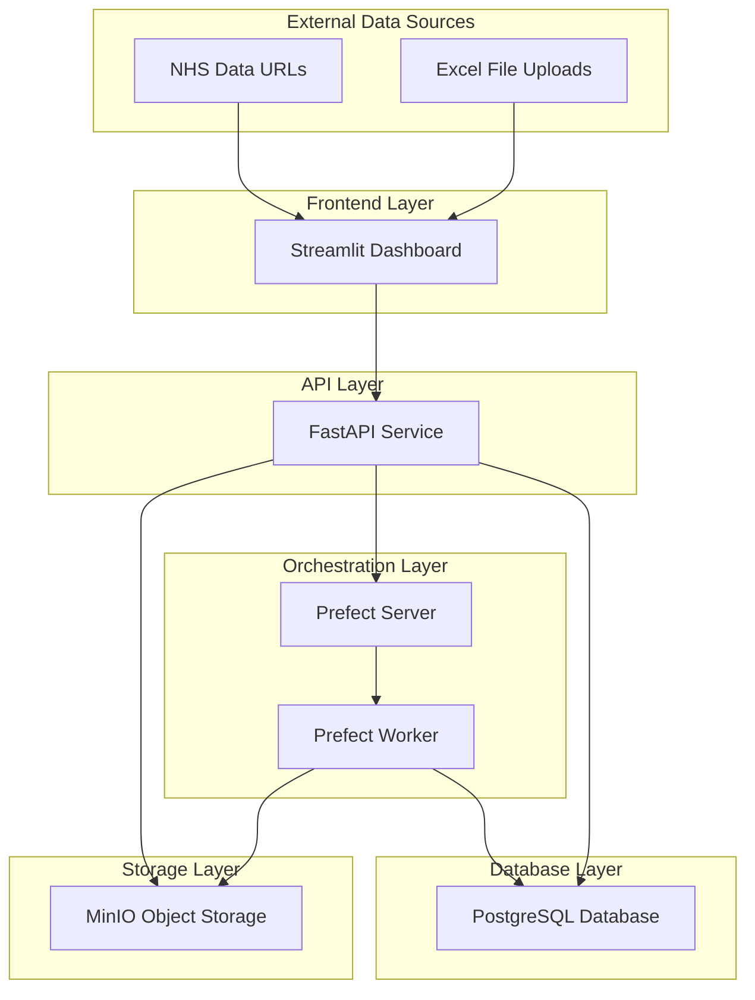
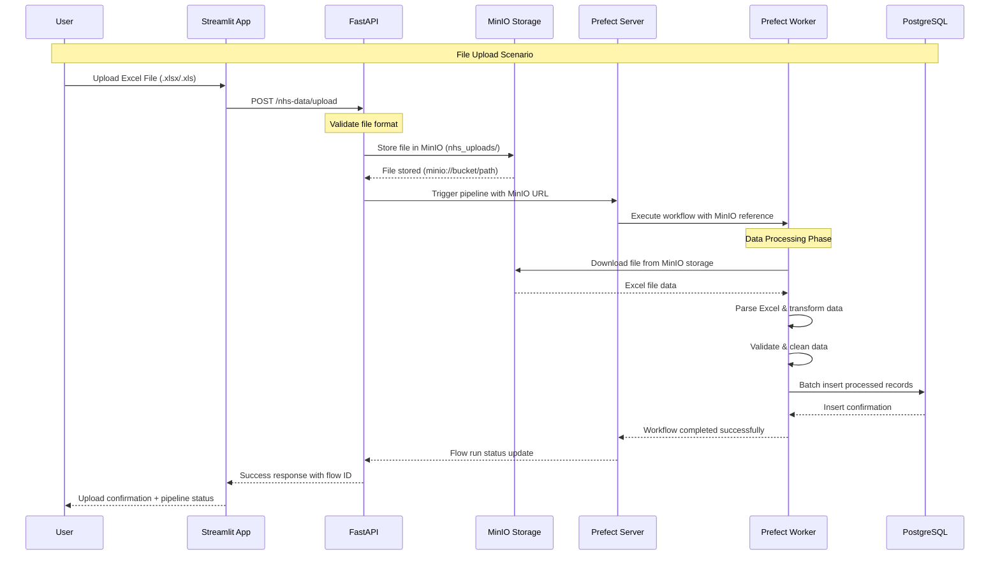
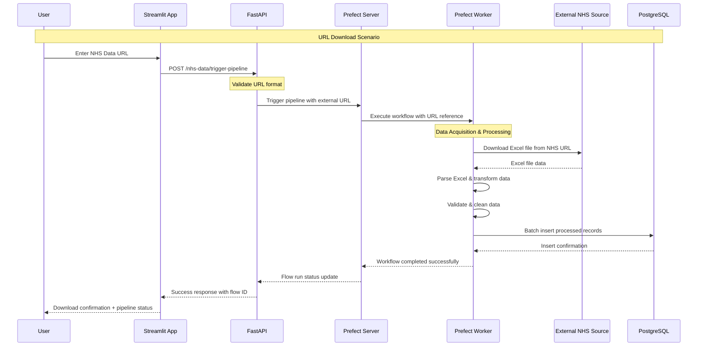
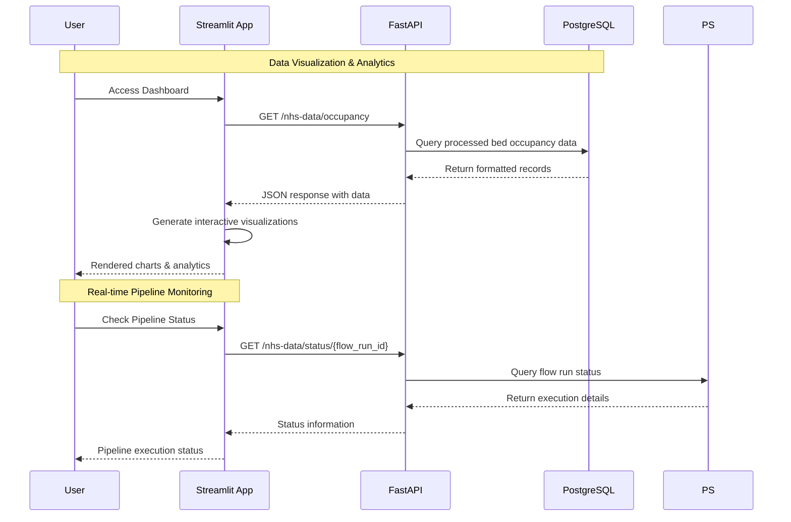

# NHS Bed Occupancy Analytics Platform - Technical Documentation

## Executive Summary

The NHS Bed Occupancy Analytics Platform is a comprehensive data engineering solution designed to automate the ingestion, processing, and visualization of NHS bed occupancy data. The platform provides a scalable, containerized architecture that enables real-time data processing workflows with robust monitoring and visualization capabilities.

## Table of Contents

1. [System Architecture](#system-architecture)
2. [Technology Stack](#technology-stack)
3. [Component Overview](#component-overview)
4. [Data Flow Architecture](#data-flow-architecture)
5. [Infrastructure Setup](#infrastructure-setup)
6. [API Documentation](#api-documentation)
7. [Database Schema](#database-schema)
8. [Workflow Orchestration](#workflow-orchestration)
9. [Deployment Guide](#deployment-guide)
10. [Monitoring and Logging](#monitoring-and-logging)
11. [Security Considerations](#security-considerations)
12. [Troubleshooting](#troubleshooting)
13. [Performance Optimization](#performance-optimization)
14. [Future Enhancements](#future-enhancements)

---

## System Architecture

### High-Level Architecture



### Component Interaction Matrix

| Component | PostgreSQL | MinIO | Prefect Server | FastAPI | Streamlit |
|-----------|------------|-------|----------------|---------|-----------|
| **PostgreSQL** | - | ❌ | ✅ | ✅ | ❌ |
| **MinIO** | ❌ | - | ✅ | ✅ | ❌ |
| **Prefect Server** | ✅ | ❌ | - | ✅ | ❌ |
| **FastAPI** | ✅ | ✅ | ✅ | - | ❌ |
| **Streamlit** | ❌ | ❌ | ❌ | ✅ | - |
| **Prefect Worker** | ✅ | ✅ | ✅ | ❌ | ❌ |

### Key Architectural Principles

#### 1. **Event-Driven Data Processing**
Every file upload or URL submission triggers an immediate Prefect pipeline execution, ensuring real-time data processing without manual intervention.

#### 2. **MinIO-Centric Storage Strategy**
- **All uploaded files persist in MinIO** before processing
- **Timestamped file organization** enables audit trails and version control
- **S3-compatible interface** provides cloud migration path
- **Decoupled storage** from processing enables horizontal scaling

#### 3. **Dual-Source Data Ingestion**
```python
# Unified processing for both sources
if url.startswith("minio://"):
    # Handle uploaded files from MinIO
    process_uploaded_file(url)
else:
    # Handle external NHS URLs
    process_external_url(url)
```

#### 4. **API-First Architecture**
All data access flows through the FastAPI layer, providing:
- Consistent data formatting and validation
- Centralized authentication point (future)
- Request/response logging and monitoring
- Rate limiting and caching capabilities

#### 5. **Containerized Microservices**
Each component runs in isolation with defined interfaces, enabling:
- Independent scaling and deployment
- Technology stack flexibility
- Fault isolation and recovery
- Development team autonomy

---

## Technology Stack

### Core Technologies

#### Backend Framework
- **FastAPI 0.104.1+**: Modern, high-performance Python web framework
- **Uvicorn 0.24.0+**: Lightning-fast ASGI server
- **Pydantic <2.0**: Data validation and settings management

#### Database & Storage
- **PostgreSQL 14**: Primary OLTP database with ACID compliance
- **SQLAlchemy**: SQL toolkit and ORM with both 1.4.x and 2.0+ versions
- **MinIO**: S3-compatible object storage for file handling
- **psycopg2-binary**: PostgreSQL adapter for Python

#### Workflow Orchestration
- **Prefect 2.19.0**: Modern workflow orchestration platform
- **prefect-aws**: AWS cloud integrations
- **boto3**: AWS SDK for enhanced cloud capabilities

#### Data Processing
- **Pandas 2.0+**: Data manipulation and analysis
- **NumPy 1.26.3**: Numerical computing foundation
- **openpyxl 3.1.2**: Excel file processing capabilities

#### Frontend & Visualization
- **Streamlit 1.28.0+**: Interactive web application framework
- **Plotly 5.15.0+**: Advanced interactive visualizations

#### Infrastructure
- **Docker & Docker Compose**: Containerization and orchestration
- **HTTPX**: Modern async HTTP client library

### Dependency Management Analysis

#### Critical Version Conflicts Identified:
1. **SQLAlchemy**: Mixed usage of v1.4.46 and v2.0.0+
2. **FastAPI**: Legacy v0.78.0 in root vs modern v0.104.1+ in components
3. **Unversioned Dependencies**: prefect-aws, boto3, requests pose stability risks

#### Security Considerations:
- Pydantic v1.x constraint may limit security updates
- Unversioned AWS dependencies create unpredictable behavior
- Legacy versions in root requirements need immediate attention

---

## Component Overview

### 1. FastAPI Service (`/api`)

**Purpose**: REST API gateway providing comprehensive data pipeline orchestration and access management

**Key Responsibilities**:
- **File Upload Orchestration**: Validates and stores Excel files in MinIO with automatic pipeline triggering
- **URL-based Data Ingestion**: Handles external NHS data URLs with direct pipeline integration
- **Pipeline Management**: Creates and monitors Prefect flow runs with real-time status tracking
- **Database Access Layer**: Provides optimized queries for processed bed occupancy data
- **MinIO Integration**: Manages object storage operations for uploaded files and artifacts
- **Health Monitoring**: Comprehensive service health checks and system monitoring

**Core Endpoints**:
- `POST /nhs-data/trigger-pipeline`: Initiate data processing workflows
- `POST /nhs-data/upload`: Handle Excel file uploads
- `GET /nhs-data/occupancy`: Retrieve processed bed occupancy data
- `GET /nhs-data/status/{flow_run_id}`: Monitor pipeline execution
- `GET /health`: Service health verification

**Technical Implementation**:
```python
# File Upload with MinIO Integration
@app.post("/nhs-data/upload")
async def upload_nhs_file(file: UploadFile = File(...)):
    # 1. Validate file format
    if not file.filename.endswith(('.xlsx', '.xls')):
        raise HTTPException(status_code=400, detail="Invalid file format")
    
    # 2. Store in MinIO with timestamped path
    object_name = f"nhs_uploads/{datetime.now().isoformat()}_{file.filename}"
    upload_file(minio_client, BUCKET_NAME, object_name, tmp_file_path)
    minio_url = f"minio://{BUCKET_NAME}/{object_name}"
    
    # 3. Trigger Prefect pipeline with MinIO reference
    flow_run = await prefect_client.create_flow_run_from_deployment(
        deployment_id=deployment.id,
        parameters={"url": minio_url, "is_upload": True}
    )
    
    return {"message": "File uploaded and pipeline started", 
            "minio_path": object_name, "flow_run_id": str(flow_run.id)}

# URL-based Pipeline Triggering
@app.post("/nhs-data/trigger-pipeline")
async def trigger_nhs_pipeline(trigger: PipelineTrigger):
    # Direct pipeline triggering for external URLs
    flow_run = await prefect_client.create_flow_run_from_deployment(
        deployment_id=deployment.id,
        parameters={"url": trigger.url, "is_upload": False}
    )
```

### 2. Prefect Worker (`/prefect-worker`)

**Purpose**: Intelligent data processing engine with dual-source ETL capabilities

**Key Responsibilities**:
- **Dual-Source Data Acquisition**: Seamlessly handles MinIO objects and external HTTP URLs
- **Excel Processing Pipeline**: Advanced multi-header Excel parsing and transformation
- **Data Quality Assurance**: Comprehensive validation and cleaning operations
- **PostgreSQL Integration**: Optimized batch insertion with conflict resolution
- **Error Resilience**: Robust retry logic and comprehensive error handling
- **Artifact Management**: Results storage and pipeline audit trails

**Intelligent Workflow Definition**:
```python
@flow
def nhs_bed_occupancy_pipeline_flow(url: str, is_upload: bool = False):
    """
    Unified ETL workflow supporting both MinIO and HTTP sources
    
    Parameters:
    - url: Either 'minio://bucket/object' or 'https://external-url'
    - is_upload: Boolean flag indicating upload vs download scenario
    """
    file_path = download_data_task(url)           # Smart source detection
    processed_data = process_bed_occupancy_data_task(file_path)  # Excel processing
    store_bed_occupancy_data_task(processed_data) # Database persistence
```

**Smart Data Processing Pipeline**:
1. **Intelligent Download Task**: 
   - **MinIO Mode**: Retrieves uploaded files from object storage
   - **HTTP Mode**: Downloads directly from external NHS URLs
   - **Format Detection**: Automatic Excel format handling
2. **Advanced Process Task**: 
   - Multi-header Excel parsing with `openpyxl`
   - Column mapping and normalization
   - Data validation and quality checks
   - Occupancy rate calculations
3. **Optimized Store Task**: 
   - Batch PostgreSQL insertion
   - Duplicate detection and handling
   - Transaction management and rollback support

### 3. Prefect Server (`/prefect-server`)

**Purpose**: Workflow orchestration and monitoring hub

**Key Responsibilities**:
- Workflow execution scheduling and management
- Task dependency resolution
- Execution state tracking and persistence
- API endpoint for worker communication
- UI dashboard for workflow monitoring

**Configuration**:
- Database backend: PostgreSQL
- API URL: `http://prefect-server:4200/api`
- UI Dashboard: `http://localhost:4200`

### 4. Streamlit Dashboard (`/streamlit_app`)

**Purpose**: Interactive web interface for data analysis and pipeline management

**Key Features**:
- **Data Upload Interface**: Support for file uploads and URL-based ingestion
- **Real-time Analytics**: Interactive charts and metrics
- **Pipeline Monitoring**: Status tracking and execution logs
- **Organization Search**: Advanced filtering and search capabilities
- **Data Visualization**: Plotly-powered interactive charts

**Page Structure**:
- **Dashboard**: Main analytics and visualization hub
- **Data Upload**: File and URL-based data ingestion
- **Pipeline Status**: Real-time workflow monitoring
- **Organization Search**: Granular data exploration

### 5. PostgreSQL Database (`/db`)

**Purpose**: Primary data persistence layer

**Configuration**:
- Version: PostgreSQL 14 Alpine
- Port Mapping: `5433:5432` (host:container)
- Persistent Storage: Docker volume `postgres_data`
- Access Credentials: `user:password@localhost:5433/mydatabase`

### 6. MinIO Object Storage (`/minio`)

**Purpose**: Centralized S3-compatible object storage serving as the data lake foundation

**Strategic Role in Data Architecture**:
- **Upload Storage Hub**: Primary storage for all user-uploaded Excel files
- **Data Lake Foundation**: Persistent storage for raw data artifacts
- **Pipeline Integration**: Seamless integration with Prefect workflows
- **Audit Trail**: Complete history of processed files with timestamp tracking
- **Scalability**: S3-compatible interface enables cloud migration readiness

**Storage Organization**:
```
minio://uploaded-files/
├── nhs_uploads/                    # User uploaded files
│   ├── 2025-07-13T20:25:04_{filename}.xlsx
│   └── 2025-07-13T20:30:15_{filename}.xlsx
└── prefect-results/                # Pipeline artifacts
    ├── processed_data_summaries/
    └── execution_logs/
```

**Configuration**:
- **API Port**: `9000` (S3-compatible operations)
- **Console Port**: `9001` (Web management interface)
- **Default Credentials**: `minioadmin:minioadmin` (production: use secrets)
- **Persistent Storage**: Docker volume `minio_data`
- **Bucket Strategy**: Segregated buckets for uploads and results

**Integration Pattern**:
```python
# File upload flow
object_name = f"nhs_uploads/{datetime.now().isoformat()}_{file.filename}"
upload_file(minio_client, BUCKET_NAME, object_name, tmp_file_path)
minio_url = f"minio://{BUCKET_NAME}/{object_name}"

# Prefect worker retrieval
if url.startswith("minio://"):
    bucket_name, object_path = parse_minio_url(url)
    minio_client.fget_object(bucket_name, object_path, local_file_path)
```

---

## Data Flow Architecture

### End-to-End Data Pipeline

The platform implements a robust, event-driven data pipeline where **all data flows through MinIO storage** before processing, ensuring data persistence, traceability, and scalable processing capabilities.

#### File Upload Data Flow


#### URL Download Data Flow


#### Data Access Flow


### Data Transformation Flow

#### 1. **Data Ingestion & Storage**
- **Source Types**: 
  - **File Uploads**: User-uploaded Excel files via Streamlit interface
  - **URL Downloads**: Direct NHS data URLs for automated processing
- **Format Support**: `.xlsx` and `.xls` Excel files with multi-header structure
- **Storage Strategy**: 
  - **File Uploads**: Immediate storage in MinIO (`nhs_uploads/` prefix)
  - **URL Downloads**: Direct processing without intermediate storage
  - **MinIO URL Format**: `minio://uploaded-files/nhs_uploads/{timestamp}_{filename}`

#### 2. **Event-Driven Pipeline Triggering**
```python
# File Upload Flow
object_name = f"nhs_uploads/{datetime.now().isoformat()}_{file.filename}"
upload_file(minio_client, BUCKET_NAME, object_name, tmp_file_path)
minio_url = f"minio://{BUCKET_NAME}/{object_name}"

# Trigger Prefect pipeline with MinIO reference
flow_run = await prefect_client.create_flow_run_from_deployment(
    deployment_id=deployment.id,
    parameters={"url": minio_url, "is_upload": True}
)
```

#### 3. **Intelligent Data Acquisition**
The Prefect worker handles both data sources seamlessly:
```python
@task
def download_data_task(url: str) -> str:
    if url.startswith("minio://"):
        # MinIO retrieval for uploaded files
        minio_client.fget_object(bucket_name, object_name, local_path)
    else:
        # HTTP download for external URLs
        httpx.stream("GET", url)
```

#### 4. **Data Processing & Transformation**
- **Excel Parsing**: Multi-header Excel files using `openpyxl` engine
- **Data Cleaning**: Column normalization and missing value handling
- **Schema Validation**: Ensures data consistency before database insertion
- **Occupancy Rate Calculation**: Automated calculation of bed utilization metrics
- **Data Quality Checks**: Validation of numerical constraints and data integrity

#### 5. **Persistent Data Storage**
- **Database**: PostgreSQL with optimized schema for analytics
- **Batch Processing**: Efficient bulk insertion for performance
- **Conflict Resolution**: Handles duplicate data scenarios gracefully
- **Transaction Management**: ACID compliance for data integrity
- **Indexing Strategy**: Optimized indexes for query performance

#### 6. **Real-time Data Access**
- **API Gateway**: FastAPI with async processing capabilities
- **Query Optimization**: Efficient database queries with filtering support
- **Response Formatting**: JSON serialization for frontend consumption
- **Caching Strategy**: Ready for Redis integration for performance enhancement

---

## Infrastructure Setup

### Docker Compose Architecture

The platform uses a multi-container Docker setup with the following services:

```yaml
# Service dependency hierarchy
services:
  db: # Foundation layer
  minio: # Storage layer
  prefect-server: # Orchestration layer
    depends_on: [db]
  api: # API layer
    depends_on: [prefect-server, db, minio]
  prefect-worker: # Processing layer
    depends_on: [prefect-server, db, minio]
  streamlit: # Presentation layer
    depends_on: [api]
```

### Network Configuration

- **Default Docker Network**: All services communicate via service names
- **Port Exposures**:
  - Streamlit: `8501` (Public Web Interface)
  - FastAPI: `5001` (API Gateway)
  - Prefect Server: `4200` (Orchestration UI/API)
  - PostgreSQL: `5433` (Database Access)
  - MinIO API: `9000` (Object Storage API)
  - MinIO Console: `9001` (Storage Management UI)

### Volume Management

```yaml
volumes:
  postgres_data: # Persistent database storage
  minio_data: # Persistent object storage
  
# Development volume mounts
./api:/app # Live code reloading
./prefect-worker:/app # Live code reloading
./streamlit_app:/app # Live code reloading
./shared:/app/shared # Shared modules
```

### Health Check Implementation

All critical services implement health checks:

```yaml
healthcheck:
  test: ["CMD", "python", "-c", "import requests; requests.get('http://localhost:5001/health', timeout=5).raise_for_status()"]
  interval: 10s
  timeout: 5s
  retries: 5
  start_period: 20s
```

---

## API Documentation

### Authentication & Authorization

Currently implements open access model suitable for internal network deployment.

**Security Note**: Production deployments should implement:
- API key authentication
- JWT token-based authorization
- Rate limiting
- CORS configuration

### Core Endpoints

#### Pipeline Management

**Trigger Pipeline from URL**
```http
POST /nhs-data/trigger-pipeline
Content-Type: application/json

{
    "url": "https://www.england.nhs.uk/statistics/wp-content/uploads/sites/2/2024/05/Beds-Open-Overnight-Web_File-Q3-2023-24-Revised-POKJH.xlsx"
}
```

**Response**:
```json
{
    "message": "Pipeline started successfully",
    "flow_run_id": "1da3d185-717b-4f93-ac85-f2c184aa5502",
    "flow_run_name": "gleaming-puffin",
    "status_url": "/nhs-data/status/1da3d185-717b-4f93-ac85-f2c184aa5502"
}
```

**Upload File**
```http
POST /nhs-data/upload
Content-Type: multipart/form-data

file: [Excel file binary data]
```

#### Data Access

**Retrieve Bed Occupancy Data**
```http
GET /nhs-data/occupancy
```

**Response**:
```json
[
    {
        "organisation_code": "R1H",
        "organisation_name": "Worcestershire Acute Hospitals NHS Foundation Trust",
        "beds_available": 850,
        "beds_occupied": 765,
        "occupancy_rate": 90.0,
        "quarter": "Q3",
        "year": 2023
    }
]
```

**Pipeline Status Monitoring**
```http
GET /nhs-data/status/{flow_run_id}
```

**Response**:
```json
{
    "flow_run_id": "1da3d185-717b-4f93-ac85-f2c184aa5502",
    "name": "gleaming-puffin",
    "state": "Completed",
    "is_completed": true,
    "is_failed": false,
    "message": "All states completed.",
    "created_at": "2025-07-13T20:25:04.093830+00:00",
    "updated_at": "2025-07-13T20:25:11.241299+00:00"
}
```

#### System Health

**Health Check**
```http
GET /health
```

**Response**:
```json
{
    "status": "healthy"
}
```

### Error Handling

The API implements comprehensive error handling with standardized HTTP status codes:

- **200**: Success
- **400**: Bad Request (Invalid file format, malformed JSON)
- **404**: Not Found (Deployment not found, invalid flow run ID)
- **500**: Internal Server Error (Database connection issues, processing failures)

Example error response:
```json
{
    "detail": "Deployment 'nhs-bed-occupancy-pipeline-flow/Data Pipeline Flow' not found. Please wait for the worker to initialize."
}
```

---

## Database Schema

### BedOccupancy Table

```sql
CREATE TABLE bed_occupancy (
    id SERIAL PRIMARY KEY,
    organisation_code VARCHAR(10),
    organisation_name VARCHAR(255) NOT NULL,
    beds_available INTEGER NOT NULL,
    beds_occupied INTEGER NOT NULL,
    occupancy_rate DECIMAL(5,2) NOT NULL,
    quarter VARCHAR(10) NOT NULL,
    year INTEGER NOT NULL,
    created_at TIMESTAMP DEFAULT CURRENT_TIMESTAMP,
    updated_at TIMESTAMP DEFAULT CURRENT_TIMESTAMP
);

-- Indexes for performance optimization
CREATE INDEX idx_bed_occupancy_org_code ON bed_occupancy(organisation_code);
CREATE INDEX idx_bed_occupancy_year_quarter ON bed_occupancy(year, quarter);
CREATE INDEX idx_bed_occupancy_occupancy_rate ON bed_occupancy(occupancy_rate);
```

### Data Model Relationships

```python
class BedOccupancy(Base):
    __tablename__ = "bed_occupancy"
    
    id = Column(Integer, primary_key=True, index=True)
    organisation_code = Column(String(10), index=True)
    organisation_name = Column(String(255), nullable=False)
    beds_available = Column(Integer, nullable=False)
    beds_occupied = Column(Integer, nullable=False)
    occupancy_rate = Column(Numeric(5,2), nullable=False)
    quarter = Column(String(10), nullable=False)
    year = Column(Integer, nullable=False)
    created_at = Column(DateTime, default=datetime.utcnow)
    updated_at = Column(DateTime, default=datetime.utcnow, onupdate=datetime.utcnow)
```

### Data Integrity Constraints

- **organisation_name**: Required field, cannot be null
- **beds_available**: Must be non-negative integer
- **beds_occupied**: Must be non-negative integer, should not exceed beds_available
- **occupancy_rate**: Calculated field, decimal precision (5,2)
- **quarter**: Standardized format (Q1, Q2, Q3, Q4)
- **year**: Four-digit integer representing reporting year

### Database Connection Management

```python
# Connection configuration
DATABASE_URL = "postgresql://user:password@db:5432/mydatabase"

engine = create_engine(DATABASE_URL)
SessionLocal = sessionmaker(autocommit=False, autoflush=False, bind=engine)

# Connection lifecycle management
def get_db():
    db = SessionLocal()
    try:
        yield db
    finally:
        db.close()
```

---

## Workflow Orchestration

### Prefect 2.19.0 Implementation

The platform leverages Prefect for robust workflow orchestration with the following architecture:

#### Deployment Strategy

```python
# Worker deployment configuration
nhs_deployment = await Deployment.build_from_flow(
    flow=nhs_bed_occupancy_pipeline_flow,
    name="Data Pipeline Flow",
    work_pool_name="default"
)
```

#### Flow Definition

```python
@flow
def nhs_bed_occupancy_pipeline_flow(url: str, is_upload: bool = False):
    """
    Main ETL workflow for NHS bed occupancy data processing
    
    Args:
        url: Source URL or MinIO path for data file
        is_upload: Boolean flag for upload vs download processing
    """
    # Task 1: Data acquisition
    file_path = download_data_task(url)
    
    # Task 2: Data processing and transformation
    processed_data = process_data_task(file_path)
    
    # Task 3: Data persistence
    result = store_data_task(processed_data)
    
    return result
```

#### Task Implementation

**Download Task**:
```python
@task
def download_data_task(url: str) -> str:
    """
    Handles both HTTP URLs and MinIO object retrieval
    
    Returns: Local file path for processing
    """
    if url.startswith("minio://"):
        return download_from_minio(url)
    else:
        return download_from_http(url)
```

**Processing Task**:
```python
@task
def process_data_task(file_path: str) -> List[Dict]:
    """
    Excel parsing, data cleaning, and transformation
    
    Processing steps:
    1. Excel file parsing with openpyxl
    2. Data validation and cleaning
    3. Occupancy rate calculation
    4. Schema normalization
    """
    df = pd.read_excel(file_path, engine='openpyxl')
    # Data transformation logic
    return processed_records
```

**Storage Task**:
```python
@task
def store_data_task(data: List[Dict]) -> Dict:
    """
    Database persistence with conflict resolution
    
    Features:
    - Batch insertion for performance
    - Duplicate detection and handling
    - Transaction management
    - Error recovery
    """
    db = SessionLocal()
    try:
        # Batch insertion logic
        return {"status": "success", "records_processed": len(data)}
    finally:
        db.close()
```

#### Work Pool Configuration

```bash
# Work pool creation
prefect work-pool create 'default' --type process

# Worker startup
prefect worker start --pool 'default'
```

#### Flow Execution Monitoring

Prefect provides comprehensive monitoring capabilities:

- **Real-time Status Tracking**: Flow and task-level execution status
- **Execution Logs**: Detailed logging for debugging and auditing
- **Retry Logic**: Configurable retry mechanisms for failed tasks
- **Resource Management**: Memory and CPU usage monitoring

---

## Deployment Guide

### Prerequisites

- **Docker Engine**: Version 20.10.0 or higher
- **Docker Compose**: Version 2.0.0 or higher
- **Available Ports**: 4200, 5001, 5433, 8501, 9000, 9001
- **System Resources**: Minimum 4GB RAM, 2 CPU cores

### Quick Start Deployment

1. **Clone Repository**:
```bash
git clone https://github.com/ZohraB612/de_eh.git
cd de_eh
```

2. **Environment Configuration**:
```bash
# Optional: Create .env file for custom configuration
cat > .env << EOF
POSTGRES_USER=user
POSTGRES_PASSWORD=password
POSTGRES_DB=mydatabase
MINIO_ROOT_USER=minioadmin
MINIO_ROOT_PASSWORD=minioadmin
EOF
```

3. **Build and Start Services**:
```bash
# Build all containers and start services
docker-compose up --build -d

# Verify service health
docker-compose ps
```

4. **Service Verification**:
```bash
# Check all services are healthy
docker-compose ps

# Verify API health
curl http://localhost:5001/health

# Access Streamlit dashboard
open http://localhost:8501
```

### Production Deployment Considerations

#### Environment Variables

```yaml
# Production environment configuration
environment:
  - POSTGRES_USER=${POSTGRES_USER}
  - POSTGRES_PASSWORD=${POSTGRES_PASSWORD}
  - POSTGRES_DB=${POSTGRES_DB}
  - MINIO_ROOT_USER=${MINIO_ROOT_USER}
  - MINIO_ROOT_PASSWORD=${MINIO_ROOT_PASSWORD}
  - PREFECT_API_URL=http://prefect-server:4200/api
  - API_BASE_URL=http://api:5001
  - FLOW_RUN_TIMEOUT=300
```

#### Security Hardening

1. **Database Security**:
   - Change default credentials
   - Enable SSL/TLS connections
   - Implement connection pooling
   - Configure backup strategies

2. **API Security**:
   - Implement authentication middleware
   - Add rate limiting
   - Configure CORS policies
   - Enable HTTPS with proper certificates

3. **Container Security**:
   - Use non-root users in containers
   - Implement resource limits
   - Enable security scanning
   - Regular base image updates

#### Scaling Considerations

```yaml
# Horizontal scaling configuration
deploy:
  replicas: 3
  resources:
    limits:
      cpus: '1.0'
      memory: 1G
    reservations:
      cpus: '0.5'
      memory: 512M
```

### Backup and Recovery

#### Database Backup
```bash
# Automated daily backup
docker exec de_eh-db-1 pg_dump -U user mydatabase > backup_$(date +%Y%m%d).sql

# Restore from backup
docker exec -i de_eh-db-1 psql -U user mydatabase < backup_20250713.sql
```

#### MinIO Backup
```bash
# Export MinIO data
docker run --rm -v de_eh_minio_data:/data -v $(pwd):/backup alpine tar czf /backup/minio_backup_$(date +%Y%m%d).tar.gz /data
```

---

## Monitoring and Logging

### Application Logging

#### FastAPI Request Logging
```python
@app.middleware("http")
async def log_requests(request: Request, call_next):
    print(f"--> API receiving request for path: {request.url.path}")
    response = await call_next(request)
    return response
```

#### Prefect Workflow Logging
```python
from prefect.logging import get_logger

logger = get_logger(__name__)

@task
def process_data_task(file_path: str):
    logger.info(f"Processing file: {file_path}")
    # Processing logic
    logger.info("Data processing completed successfully")
```

### Service Health Monitoring

#### Health Check Endpoints

**API Health Check**:
```http
GET /health
Response: {"status": "healthy"}
```

**Database Health Check**:
```bash
docker exec de_eh-db-1 pg_isready -U user -d mydatabase
```

**MinIO Health Check**:
```bash
curl -f http://localhost:9000/minio/health/live
```

#### Container Health Monitoring

```yaml
healthcheck:
  test: ["CMD", "python", "-c", "import requests; requests.get('http://localhost:5001/health', timeout=5).raise_for_status()"]
  interval: 10s
  timeout: 5s
  retries: 5
  start_period: 20s
```

### Performance Metrics

#### Key Performance Indicators (KPIs)

1. **Pipeline Execution Time**: Average time from trigger to completion
2. **Data Processing Throughput**: Records processed per minute
3. **API Response Times**: P95 response times for critical endpoints
4. **Database Query Performance**: Query execution times and connection pool usage
5. **Resource Utilization**: CPU, memory, and storage usage patterns

#### Monitoring Implementation

```python
# Performance monitoring decorator
def monitor_performance(func):
    @wraps(func)
    async def wrapper(*args, **kwargs):
        start_time = time.time()
        try:
            result = await func(*args, **kwargs)
            execution_time = time.time() - start_time
            logger.info(f"{func.__name__} executed in {execution_time:.2f}s")
            return result
        except Exception as e:
            logger.error(f"{func.__name__} failed after {time.time() - start_time:.2f}s: {e}")
            raise
    return wrapper
```

### Log Aggregation

#### Docker Compose Logging Configuration

```yaml
services:
  api:
    logging:
      driver: "json-file"
      options:
        max-size: "10m"
        max-file: "3"
```

#### Centralized Logging (Production)

For production deployments, consider implementing:
- **ELK Stack**: Elasticsearch, Logstash, Kibana
- **Prometheus + Grafana**: Metrics collection and visualization
- **Jaeger**: Distributed tracing for microservices

---

## Security Considerations

### Current Security Posture

#### Strengths
- **Network Isolation**: Docker network segmentation
- **Health Check Implementation**: Proactive service monitoring
- **Input Validation**: Pydantic models for API validation
- **Database Isolation**: Containerized PostgreSQL with limited access

#### Areas for Improvement

1. **Authentication & Authorization**:
   - Currently no authentication mechanism
   - Open API access poses security risk
   - Recommendation: Implement JWT-based authentication

2. **Data Encryption**:
   - No encryption at rest or in transit
   - Database communications unencrypted
   - Recommendation: Implement TLS/SSL across all services

3. **Secrets Management**:
   - Hardcoded credentials in docker-compose.yml
   - MinIO default credentials exposed
   - Recommendation: Use Docker secrets or external vault

4. **Input Sanitization**:
   - Limited validation of Excel file contents
   - Potential for malicious file uploads
   - Recommendation: Implement comprehensive file validation

### Security Implementation Roadmap

#### Phase 1: Basic Security (Immediate)
```yaml
# Environment-based secrets
environment:
  - POSTGRES_PASSWORD_FILE=/run/secrets/postgres_password
  - MINIO_ROOT_PASSWORD_FILE=/run/secrets/minio_password

secrets:
  postgres_password:
    external: true
  minio_password:
    external: true
```

#### Phase 2: Authentication (Short-term)
```python
# JWT authentication middleware
@app.middleware("http")
async def authenticate_request(request: Request, call_next):
    if request.url.path.startswith("/health"):
        return await call_next(request)
    
    token = request.headers.get("Authorization")
    if not verify_jwt_token(token):
        raise HTTPException(status_code=401, detail="Unauthorized")
    
    return await call_next(request)
```

#### Phase 3: Encryption (Medium-term)
- Implement HTTPS with Let's Encrypt certificates
- Enable PostgreSQL SSL connections
- Add MinIO TLS configuration
- Implement data-at-rest encryption

#### Phase 4: Advanced Security (Long-term)
- Web Application Firewall (WAF) integration
- Rate limiting and DDoS protection
- Security scanning and vulnerability assessment
- Audit logging and SIEM integration

---

## Troubleshooting

### Common Issues and Solutions

#### 1. Container Startup Failures

**Symptom**: Services fail to start or remain unhealthy

**Diagnosis**:
```bash
# Check container status
docker-compose ps

# View service logs
docker-compose logs [service_name]

# Check resource usage
docker stats
```

**Common Causes**:
- Port conflicts with existing services
- Insufficient system resources
- Database connection failures
- Volume mount permissions

**Solutions**:
```bash
# Port conflict resolution
netstat -tulpn | grep [port_number]
# Change ports in docker-compose.yml

# Resource allocation
docker system df
docker system prune -a

# Volume permissions
sudo chown -R $USER:$USER ./data/
```

#### 2. Pipeline Execution Failures

**Symptom**: Prefect workflows fail or timeout

**Diagnosis**:
```bash
# Check Prefect worker logs
docker-compose logs prefect-worker

# Verify deployment status
docker-compose exec prefect-worker prefect deployment ls

# Check flow run status
curl http://localhost:5001/nhs-data/status/{flow_run_id}
```

**Common Causes**:
- Network connectivity issues
- File format incompatibility
- Database connection timeout
- Memory constraints during processing

**Solutions**:
```python
# Increase timeout configuration
FLOW_RUN_TIMEOUT=600

# Memory optimization
df = pd.read_excel(file_path, chunksize=1000)

# Error handling enhancement
@task(retries=3, retry_delay_seconds=60)
def resilient_task():
    # Implementation with error handling
```

#### 3. Database Connection Issues

**Symptom**: API returns database-related errors

**Diagnosis**:
```bash
# Test database connectivity
docker exec de_eh-db-1 pg_isready -U user -d mydatabase

# Check connection pool status
docker-compose logs api | grep -i "database\|connection"

# Verify database schema
docker exec -it de_eh-db-1 psql -U user -d mydatabase -c "\dt"
```

**Solutions**:
```python
# Connection pool configuration
engine = create_engine(
    DATABASE_URL,
    pool_size=20,
    max_overflow=0,
    pool_pre_ping=True,
    pool_recycle=3600
)

# Retry logic for database operations
@retry(stop=stop_after_attempt(3), wait=wait_exponential(multiplier=1, min=4, max=10))
def database_operation():
    # Database logic
```

#### 4. Frontend Display Issues

**Symptom**: Streamlit dashboard shows empty data or errors

**Diagnosis**:
```bash
# Check API connectivity
curl http://localhost:5001/nhs-data/occupancy

# Verify Streamlit logs
docker-compose logs streamlit

# Test data availability
docker exec -it de_eh-db-1 psql -U user -d mydatabase -c "SELECT COUNT(*) FROM bed_occupancy;"
```

#### 5. File Upload Problems

**Symptom**: Excel file uploads fail or produce errors

**Common Issues**:
- File size limitations
- Unsupported Excel formats
- MinIO connectivity problems
- Temporary file cleanup failures

**Solutions**:
```python
# File validation enhancement
def validate_excel_file(file):
    if not file.filename.endswith(('.xlsx', '.xls')):
        raise HTTPException(status_code=400, detail="Invalid file format")
    
    if file.size > 50 * 1024 * 1024:  # 50MB limit
        raise HTTPException(status_code=400, detail="File too large")

# Robust cleanup
try:
    # File processing
finally:
    if os.path.exists(temp_file_path):
        os.unlink(temp_file_path)
```

### Debugging Tools and Commands

#### Container Debugging
```bash
# Execute shell in container
docker-compose exec [service_name] /bin/bash

# View real-time logs
docker-compose logs -f [service_name]

# Resource monitoring
docker stats [container_name]

# Network inspection
docker network inspect de_eh_default
```

#### Database Debugging
```bash
# Connect to PostgreSQL
docker exec -it de_eh-db-1 psql -U user -d mydatabase

# Common SQL queries
SELECT COUNT(*) FROM bed_occupancy;
SELECT DISTINCT quarter, year FROM bed_occupancy ORDER BY year DESC, quarter;
SELECT organisation_name, AVG(occupancy_rate) FROM bed_occupancy GROUP BY organisation_name LIMIT 10;
```

#### API Debugging
```bash
# Test API endpoints
curl -X GET http://localhost:5001/health
curl -X GET http://localhost:5001/nhs-data/occupancy
curl -X POST http://localhost:5001/nhs-data/trigger-pipeline -H "Content-Type: application/json" -d '{"url":"test"}'
```

---

## Performance Optimization

### Database Optimization

#### Index Strategy
```sql
-- Performance-critical indexes
CREATE INDEX CONCURRENTLY idx_bed_occupancy_composite 
ON bed_occupancy(year DESC, quarter, occupancy_rate DESC);

CREATE INDEX CONCURRENTLY idx_bed_occupancy_org_search 
ON bed_occupancy USING gin(to_tsvector('english', organisation_name));

-- Partial indexes for frequently accessed data
CREATE INDEX CONCURRENTLY idx_bed_occupancy_recent 
ON bed_occupancy(created_at) 
WHERE created_at > NOW() - INTERVAL '1 year';
```

#### Query Optimization
```python
# Efficient pagination
def get_occupancy_data_paginated(skip: int = 0, limit: int = 100):
    return db.query(BedOccupancy)\
             .order_by(BedOccupancy.occupancy_rate.desc())\
             .offset(skip)\
             .limit(limit)\
             .all()

# Aggregation optimization
def get_summary_statistics():
    return db.query(
        func.avg(BedOccupancy.occupancy_rate).label('avg_occupancy'),
        func.max(BedOccupancy.occupancy_rate).label('max_occupancy'),
        func.count(BedOccupancy.id).label('total_records')
    ).first()
```

### Application Performance

#### Async Processing
```python
# Async API endpoints for better concurrency
@app.get("/nhs-data/occupancy")
async def get_occupancy_data():
    async with async_session() as session:
        result = await session.execute(select(BedOccupancy))
        return result.scalars().all()

# Background task processing
@app.post("/nhs-data/trigger-pipeline")
async def trigger_pipeline(trigger: PipelineTrigger, background_tasks: BackgroundTasks):
    background_tasks.add_task(process_pipeline, trigger.url)
    return {"message": "Pipeline queued for processing"}
```

#### Caching Strategy
```python
# Redis caching for frequently accessed data
@lru_cache(maxsize=128)
def get_cached_summary_stats():
    return calculate_summary_statistics()

# Database query result caching
@app.get("/nhs-data/occupancy")
async def get_occupancy_data():
    cache_key = "occupancy_data"
    cached_data = redis_client.get(cache_key)
    
    if cached_data:
        return json.loads(cached_data)
    
    data = fetch_from_database()
    redis_client.setex(cache_key, 300, json.dumps(data))  # 5-minute cache
    return data
```

#### Memory Optimization
```python
# Streaming data processing for large files
def process_large_excel_file(file_path: str):
    chunk_size = 1000
    for chunk in pd.read_excel(file_path, chunksize=chunk_size):
        processed_chunk = transform_data(chunk)
        batch_insert_to_db(processed_chunk)
        del chunk, processed_chunk  # Explicit memory cleanup

# Generator pattern for large datasets
def stream_occupancy_data():
    offset = 0
    batch_size = 1000
    
    while True:
        batch = db.query(BedOccupancy).offset(offset).limit(batch_size).all()
        if not batch:
            break
        
        for record in batch:
            yield record
        
        offset += batch_size
```

### Infrastructure Scaling

#### Horizontal Scaling
```yaml
# Docker Swarm configuration
version: '3.8'
services:
  api:
    deploy:
      replicas: 3
      resources:
        limits:
          cpus: '1.0'
          memory: 1G
      restart_policy:
        condition: on-failure
        delay: 5s
        max_attempts: 3
```

#### Resource Monitoring
```python
# Resource usage monitoring
import psutil

def log_system_metrics():
    cpu_percent = psutil.cpu_percent(interval=1)
    memory = psutil.virtual_memory()
    disk = psutil.disk_usage('/')
    
    logger.info(f"CPU: {cpu_percent}%, Memory: {memory.percent}%, Disk: {disk.percent}%")
```

---

## Future Enhancements

### Short-term Improvements (1-3 months)

#### 1. Enhanced Security Implementation
- **JWT Authentication**: Implement secure API access
- **HTTPS/TLS**: Enable encrypted communications
- **Input Validation**: Enhanced file validation and sanitization
- **Audit Logging**: Comprehensive activity tracking

#### 2. Advanced Data Processing
```python
# Data quality validation
@task
def validate_data_quality(df: pd.DataFrame) -> Dict:
    """
    Comprehensive data quality checks:
    - Missing value detection
    - Outlier identification
    - Data consistency validation
    - Schema compliance verification
    """
    quality_report = {
        'missing_values': df.isnull().sum().to_dict(),
        'outliers': detect_outliers(df),
        'schema_compliance': validate_schema(df)
    }
    return quality_report

# Real-time data streaming
@flow
def real_time_data_processing_flow():
    """
    Implement streaming data processing for real-time updates
    """
    while True:
        new_data = check_for_new_data()
        if new_data:
            process_incremental_data(new_data)
        await asyncio.sleep(300)  # Check every 5 minutes
```

#### 3. Advanced Analytics Features
- **Predictive Analytics**: Bed occupancy forecasting
- **Anomaly Detection**: Automated outlier identification
- **Trend Analysis**: Historical pattern recognition
- **Capacity Planning**: Resource optimization recommendations

### Medium-term Enhancements (3-6 months)

#### 1. Multi-tenant Architecture
```python
# Tenant-aware data model
class TenantAwareBedOccupancy(Base):
    __tablename__ = "bed_occupancy"
    
    tenant_id = Column(String(50), nullable=False, index=True)
    # ... existing fields
    
    __table_args__ = (
        Index('idx_tenant_year_quarter', 'tenant_id', 'year', 'quarter'),
    )
```

#### 2. Advanced Monitoring and Alerting
```python
# Prometheus metrics integration
from prometheus_client import Counter, Histogram, Gauge

pipeline_executions = Counter('pipeline_executions_total', 'Total pipeline executions')
processing_time = Histogram('data_processing_seconds', 'Time spent processing data')
active_connections = Gauge('database_connections_active', 'Active database connections')

@app.middleware("http")
async def metrics_middleware(request: Request, call_next):
    start_time = time.time()
    response = await call_next(request)
    processing_time.observe(time.time() - start_time)
    return response
```

#### 3. Data Lake Integration
- **Apache Airflow**: Advanced workflow orchestration
- **Apache Spark**: Large-scale data processing
- **Delta Lake**: ACID transactions for big data
- **Apache Kafka**: Real-time data streaming

### Long-term Vision (6-12 months)

#### 1. Machine Learning Pipeline
```python
# ML model training pipeline
@flow
def ml_model_training_flow():
    """
    Automated ML pipeline for predictive analytics:
    - Feature engineering
    - Model training and validation
    - Hyperparameter optimization
    - Model deployment and monitoring
    """
    raw_data = extract_training_data()
    features = engineer_features(raw_data)
    model = train_prediction_model(features)
    deploy_model_to_production(model)

# Real-time predictions
@app.post("/predict/occupancy")
async def predict_occupancy(prediction_request: PredictionRequest):
    """
    Real-time bed occupancy predictions
    """
    model = load_production_model()
    prediction = model.predict(prediction_request.features)
    return {"predicted_occupancy": prediction, "confidence": model.confidence}
```

#### 2. Advanced Data Governance
- **Data Lineage Tracking**: Complete data flow documentation
- **Data Quality Monitoring**: Automated DQ metrics and alerts
- **Compliance Management**: GDPR/HIPAA compliance features
- **Data Catalog**: Comprehensive metadata management

#### 3. Cloud-Native Architecture
```yaml
# Kubernetes deployment
apiVersion: apps/v1
kind: Deployment
metadata:
  name: nhs-analytics-api
spec:
  replicas: 3
  selector:
    matchLabels:
      app: nhs-analytics-api
  template:
    metadata:
      labels:
        app: nhs-analytics-api
    spec:
      containers:
      - name: api
        image: nhs-analytics/api:latest
        resources:
          requests:
            memory: "512Mi"
            cpu: "250m"
          limits:
            memory: "1Gi"
            cpu: "500m"
```

### Technology Evolution Roadmap

#### Current Stack → Target Stack
- **FastAPI** → FastAPI + GraphQL
- **PostgreSQL** → PostgreSQL + ClickHouse (Analytics)
- **MinIO** → MinIO + Apache Iceberg
- **Prefect** → Prefect + Apache Airflow
- **Streamlit** → React + D3.js (Custom Frontend)
- **Docker Compose** → Kubernetes + Helm

#### Integration Opportunities
- **NHS Digital APIs**: Direct integration with official data sources
- **FHIR Standard**: Healthcare data interoperability
- **HL7 Integration**: Clinical data exchange
- **Public Health APIs**: Enhanced data enrichment

---

## Conclusion

The NHS Bed Occupancy Analytics Platform represents a comprehensive data engineering solution that successfully addresses the challenges of healthcare data processing, analysis, and visualization. The platform's modular architecture, robust error handling, and scalable design make it well-suited for production deployment and future enhancement.

### Key Achievements

1. **Automated Data Pipeline**: Seamless ingestion from multiple sources
2. **Real-time Processing**: Prefect-based workflow orchestration
3. **Interactive Visualization**: Streamlit-powered analytics dashboard
4. **Scalable Architecture**: Containerized microservices design
5. **Comprehensive API**: RESTful endpoints for data access and management

### Technical Strengths

- **Modular Design**: Clear separation of concerns across components
- **Error Resilience**: Comprehensive error handling and retry logic
- **Performance Optimization**: Database indexing and query optimization
- **Monitoring Capabilities**: Health checks and logging throughout the stack
- **Development Velocity**: Live code reloading for rapid iteration

### Production Readiness

The platform is ready for production deployment with the implementation of the security enhancements outlined in this documentation. The comprehensive monitoring, logging, and error handling mechanisms provide the operational visibility required for enterprise deployment.

This technical documentation serves as both a deployment guide and a foundation for future enhancements, ensuring that the platform can evolve with changing requirements and scale with growing data volumes.

---

## Appendix

### Command Reference

```bash
# Development commands
docker-compose up --build -d                    # Start all services
docker-compose down                              # Stop all services
docker-compose logs -f [service_name]           # View service logs
docker-compose exec [service_name] /bin/bash    # Access container shell

# Database commands
docker exec -it de_eh-db-1 psql -U user -d mydatabase
\dt                                              # List tables
\d bed_occupancy                                 # Describe table schema

# API testing
curl http://localhost:5001/health                # Health check
curl http://localhost:5001/nhs-data/occupancy   # Get data

# Backup and restore
docker exec de_eh-db-1 pg_dump -U user mydatabase > backup.sql
docker exec -i de_eh-db-1 psql -U user mydatabase < backup.sql
```

### Environment Variables Reference

| Variable | Default | Description |
|----------|---------|-------------|
| `POSTGRES_USER` | user | Database username |
| `POSTGRES_PASSWORD` | password | Database password |
| `POSTGRES_DB` | mydatabase | Database name |
| `MINIO_ROOT_USER` | minioadmin | MinIO admin username |
| `MINIO_ROOT_PASSWORD` | minioadmin | MinIO admin password |
| `PREFECT_API_URL` | http://prefect-server:4200/api | Prefect server endpoint |
| `API_BASE_URL` | http://api:5001 | FastAPI service endpoint |
| `FLOW_RUN_TIMEOUT` | 180 | Pipeline execution timeout |

### Port Reference

| Service | Port | Purpose |
|---------|------|---------|
| Streamlit | 8501 | Web dashboard |
| FastAPI | 5001 | REST API |
| Prefect Server | 4200 | Workflow UI/API |
| PostgreSQL | 5433 | Database access |
| MinIO API | 9000 | Object storage API |
| MinIO Console | 9001 | Storage management UI |